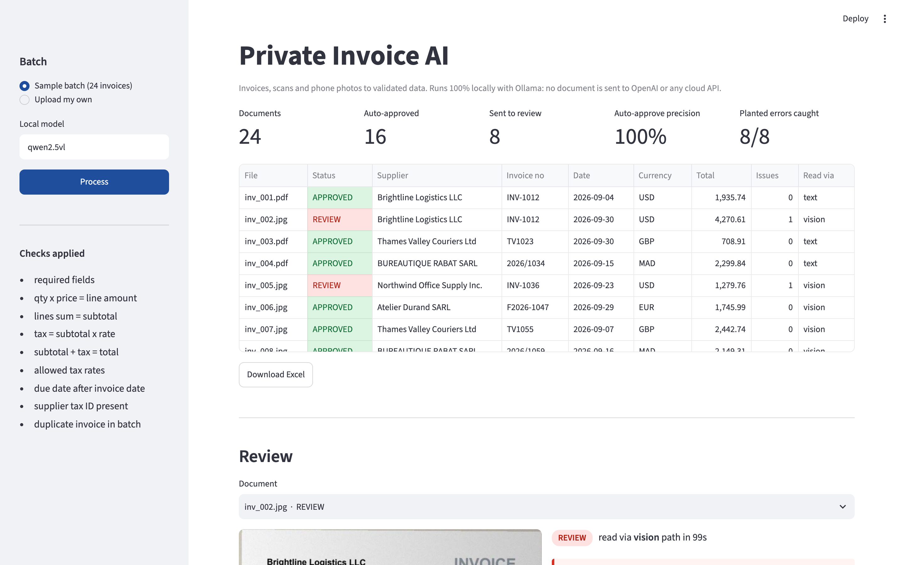
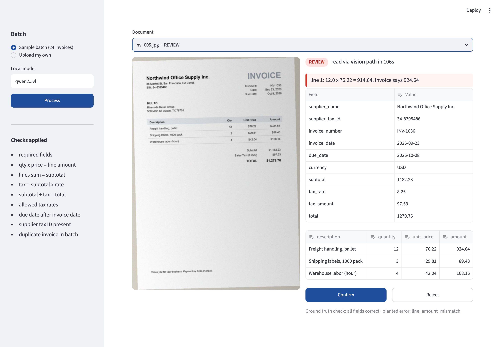

# Private Invoice AI

Invoices, scans and phone photos turned into validated data, **running 100% locally**. No document is sent to OpenAI or any cloud API.

The model reads. Code checks. A person decides on anything uncertain.

```
 PDF / scan / photo ──► route ──► local model (Ollama, qwen2.5vl) ──► normalize ──► 9 business checks ──► APPROVED
                         │          copies raw text only                 tested code                       │
                         │                                                                                 └► REVIEW + reason
                         ├─ digital PDF: text layer path (layout preserved)
                         └─ scan / photo: vision path
                                                                   ──► Excel (summary, invoices, line items, review queue, accuracy)
                                                                   ──► Streamlit review screen
```

## Results on the sample batch

Local run on an Apple M1 (16 GB), qwen2.5vl 7B via Ollama, temperature 0.

| | Dev batch (seed 7) | **Held-out batch (seed 2026)** |
|---|---|---|
| Invoices | 24 (12 photos) | **24 (7 photos)** |
| Header field accuracy | 99.6% → 100% after fix | **100%** |
| Invoices fully correct (all fields + every line item) | 23/24 → 24/24 | **24/24** |
| Planted errors caught (sent to review) | 8/8 | **8/8** |
| Auto-approved | 16 | **16** |
| Wrong data reaching auto-approval | 1 → 0 | **0** |
| Avg time, digital PDF / photo | 48 s / 86 s | **39 s / 68 s** |

How these numbers were made:
- The dev batch was used to build the pipeline. Its one miss (the model copied the label into `FACTURE N° 2026/1168`) was fixed in `normalize.py` with a unit test, then re-scored from cached outputs. The first-run report is kept in `out/report_run1.json`.
- The held-out batch was generated with a new seed after that fix and run once, untouched.
- Both batches are synthetic and clean compared with real supplier documents. Expect lower accuracy on crumpled, handwritten or multi-page invoices. That is exactly why every invoice goes through the checks, and why a real project starts with a test on your own documents.




## Why it is built this way

- **No blind trust in the model.** The model only copies strings as printed. Numbers, dates (`15/09/2026`, `Sep 14, 2026`, `04.10.2026`) and currencies (`€`, `£`, `$`, `DH`) are normalized by deterministic, unit-tested code.
- **Arithmetic catches misreads.** A misread digit breaks quantity x price, the line sum, the tax or the total, so the invoice goes to review instead of your system.
- **Measured, not claimed.** Every sample has ground truth, so the pipeline reports field accuracy, line-item accuracy, auto-approve precision and how many planted errors were caught.
- **Private by default.** Ollama on your own machine or server. Swap in vLLM or a cloud API with a no-training agreement if you prefer.

## Business checks

| Check | Example flag |
|---|---|
| Required fields | invoice_number is missing |
| Line amount | line 3: 50 x 61.18 = 3059.00, invoice says 3099.00 |
| Lines vs subtotal | line items sum to 5990.07, subtotal says 6030.07 |
| Tax vs rate | 20% of 410.00 = 82.00, invoice says 73.80 |
| Subtotal + tax vs total | subtotal + tax = 464.45, total says 484.45 |
| Allowed tax rates | tax rate 17% is not an expected rate |
| Dates | due date 2026-09-02 is before invoice date 2026-09-12 |
| Supplier tax ID | supplier tax ID (VAT / ICE) not found |
| Duplicates | invoice INV-1012 from Brightline Logistics LLC already processed |

Rules are configurable (`Rules` in `validate.py`): tax rates, tolerance, tax ID requirement.

## Sample data

24 synthetic invoices generated by `invoice_ai.synth` with ground truth:

- 4 layouts: US (`$`, `Sep 14, 2026`), French (TVA, HT/TTC, `1 234,50 €`), UK (VAT, `£`), Moroccan (ICE, `DH`, `04.10.2026`)
- half degraded into phone photos (rotation, uneven light, blur, noise, JPEG)
- 8 with planted errors: wrong total, wrong line amount, wrong tax, missing tax ID, due date before issue date, duplicate

Synthetic data keeps the repo free of anyone's real invoices. Real-world accuracy depends on the documents; test on your own samples.

## Run it

```bash
# 1. local model
ollama pull qwen2.5vl

# 2. install
uv sync

# 3. sample data (already in data/samples) or regenerate
uv run python -m invoice_ai generate data/samples

# 4. batch run -> out/invoices.xlsx + out/report.json
uv run python -m invoice_ai run data/samples --out out

# 5. review screen
uv run streamlit run app.py

# tests
uv run pytest -q
```

## Layout

```
src/invoice_ai/
  schema.py      canonical Invoice model
  extract.py     routing + local model call (raw strings only)
  normalize.py   numbers, dates, currency, tax IDs (deterministic)
  validate.py    business checks -> APPROVED / REVIEW
  evaluate.py    accuracy vs ground truth
  export.py      Excel workbook
  pipeline.py    batch run with caching
  synth.py       synthetic invoices + ground truth
app.py           Streamlit review screen
```

## Author

Said Ibenariba, data scientist and AI engineer. I took a vision-language invoice model to production at Orange Business (1,000+ carrier invoice formats, FastAPI + Docker, air-gapped). Available for document-processing projects: [hire me on Upwork](https://www.upwork.com/freelancers/~01940599324880c3de).
